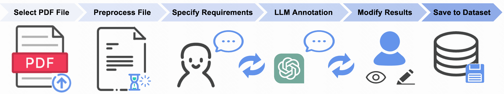

# PDFChatAnnotator

**PDFChatAnnotator**：一个面向 PDF 格式图录的多模态数据人机协同标注工具。  
🌐 [English Version / 英文版](./README.md)

## 📝 项目简介

**PDFChatAnnotator** 是一款结合人类专家与大语言模型（LLM）能力的协同标注工具，用于标注 PDF 格式图录中的多模态数据。通过交互式工作流与智能建议，它旨在提升标注效率与准确性。

📄 **相关论文**：

本项目基于我们发表于 ACM IUI 2024 的研究成果：  
[PDFChatAnnotator: A Human-LLM Collaborative Multi-Modal Data Annotation Tool for PDF-Format Catalogs](https://dl.acm.org/doi/abs/10.1145/3640543.3645174)

### 📌 版本更新

**当前版本：2.0**

- 在 1.0 版本中，标注数据保存到 MySQL 数据库，需要额外的环境搭建和配置。
- 在 2.0 版本中，为了简化安装与使用流程，特别是降低非计算机专业用户的上手门槛，已改为将标注结果直接保存为 Excel 文件（`.xlsx` 格式）。  
  这一改动使得工具开箱即用，更加易于上手。

### 📊 系统总览



### 🖍️ 交互式标注界面


## 📌 使用前须知

- 当前支持的图录类型为：

  - 每一页的图片仅与该页的文字内容相关联 (a)。
  - 在新一页文字开始之前出现的所有图片，均与当前页的文字内容相关联 (b)。
  - 在一页中存在多个图片-文字匹配对，每张图片与其下方的文字内容相关联（c）。⚠️ 由于该类型与图录自身特性高度相关，目前暂未开源。

    

## ⚙️ 安装说明

### 环境依赖

- Python 3.9
- Anaconda（推荐用于环境管理）
- Visual Studio Code（推荐开发环境）

### 1. 下载并设置项目

1. 下载项目：

   - 访问：https://github.com/VanillaTY/PDFChatAnnotator
   - 点击绿色的 `Code` 按钮，选择 `Download ZIP`
   - 将 ZIP 文件解压至合适位置（如桌面）

2. 使用 VS Code 打开项目：
   - 将解压后的文件夹拖入 VS Code
   - 如果提示 “Do you trust the authors?”，请选择 “Yes”

### 2. 配置 Python 环境

#### 使用 Anaconda（推荐）

1. 安装 Anaconda：

   - 下载链接：https://www.anaconda.com/download
   - 按提示完成安装
   - Windows 用户请在安装过程中勾选 “Add Anaconda to system PATH”

2. 创建并激活虚拟环境：
   ```bash
   conda create -n pdfannotator python=3.9
   conda activate pdfannotator
   ```

### 3. 安装依赖项

1. 安装项目依赖：

   ```bash
   pip install -r requirements.txt
   ```

2. 安装特定系统依赖：
   - **Windows**:
     ```bash
     pip install pyreadline3
     ```
   - **macOS**:
     ```bash
     pip install readline
     ```

### 4. 配置 API Key

1. 获取 API Key：

   - 访问：https://api.chatanywhere.tech/#/
   - 注册并购买套餐，获取你的 API Key

2. 设置 API Key：
   - 打开 `utils/prompt.py`
   - 将以下内容替换为你的密钥与 API 地址：
     ```python
     api_key = "your_api_key_here"
     base_url = "your_base_url_here"
     ```

## 🚀 启动项目

1. 激活环境：

   ```bash
   conda activate pdfannotator
   ```

2. 启动开发服务器：

   ```bash
   python manage.py runserver
   ```

3. 访问系统：
   - 打开浏览器
   - 访问 http://127.0.0.1:8000/

## 📄 PDF 文件预处理（使用前必做）

在运行系统前，必须先对 PDF 文件进行预处理，以提取必要的文本与图像信息。

请根据以下指南完成预处理步骤：

- 📘 [中文预处理教程](./file-preprocess/README.md)
- 📙 [English Preprocessing Guide](./file-preprocess/README.en.md)

⚠️ 本步骤需要支持 GPU 的运行环境。

## 📌 快速开始

日常使用流程如下：

1. 打开 VS Code 并加载项目
2. 打开终端并运行：
   ```bash
   conda activate pdfannotator
   python manage.py runserver
   ```
3. 在浏览器中访问：http://127.0.0.1:8000/

如需更详细的安装指南，请参考：[安装教程（小白版）](./安装教程小白版.md)。
